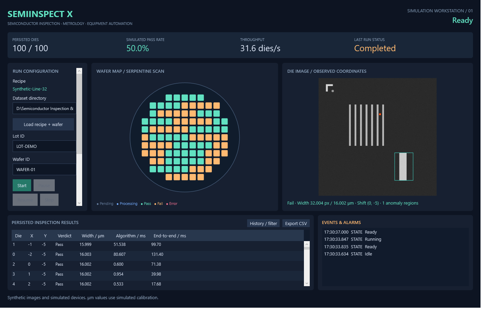
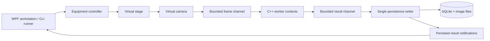

# SemiInspectX

**A simulated semiconductor inspection and metrology workstation, built with C#/.NET, WPF and a native C++17/OpenCV engine.**

[中文说明](README_CN.md) · [Architecture](docs/architecture.md) · [Verification](docs/verification.md) · [Interview walkthrough](docs/interview-guide.md)



SemiInspectX coordinates a virtual motion stage and camera, inspects patterned die images, measures line widths, saves traceable results and renders a wafer map. It includes deterministic equipment faults, bounded processing queues, state-machine regression tests and reproducible performance experiments.

This is an educational simulation. It does not implement KLA software, control production equipment, or validate physical semiconductor dimensions. Micrometer values use a simulated pixel scale.

## Run locally

Windows x64, PowerShell, Git and the Visual Studio C++ desktop workload are required. Dependency downloads and generated assets stay in the project's `.tools`, `build`, `datasets/generated` and `artifacts` directories. An existing Visual Studio installation uses its original installation path.

```powershell
./scripts/bootstrap.ps1 -InstallCpp
./scripts/build.ps1
./scripts/run.ps1
```

The build script produces a deterministic 100-die demo dataset if one does not already exist. The desktop loads `recipes/default.json` automatically. Configure a fault before Start; after a fault, select **None**, then **Reset**, then **Start** to create a new run. Invalid recipes are rejected before production begins.

The portable release is self-contained and carries the MSVC runtime DLLs. Extract it to a writable folder and run `SemiInspectX.Desktop.exe`; no .NET SDK is needed.

## What is implemented

|Capability|Behavior|
|---|---|
|Native vision|Translation alignment, reference differencing, morphology, connected components|
|Metrology|Multiple edge profiles; pixels and simulated μm; tolerance checks|
|Equipment control|Ready, Running, Pausing, Paused, Stopping and Error transitions|
|Simulation|Serpentine scan, labeled synthetic frames, camera and stage delays|
|Fault injection|Camera disconnect, stage timeout, invalid image, invalid recipe, failed database write|
|Concurrency|Serial baseline and bounded acquisition / worker / persistence pipeline|
|Traceability|SQLite run IDs, lot/wafer IDs, immutable recipe snapshots, image paths, results and events|
|Desktop|Wafer map, anomaly overlay, result table, alarms, exact-match history filters, CSV export|
|Verification|Native, interop, integration, fault recovery and 1,000-cycle lifecycle tests|
|Delivery|GitHub Actions workflows, self-contained Windows package, seeded evaluation and benchmark tools|

## Reproduce the evidence

```powershell
./scripts/evaluate.ps1
./.tools/dotnet/dotnet.exe src/SemiInspectX.Runner/bin/Release/net10.0/SemiInspectX.Runner.dll inspect --dataset datasets/generated/demo --output artifacts/run --count 100
./.tools/dotnet/dotnet.exe src/SemiInspectX.Runner/bin/Release/net10.0/SemiInspectX.Runner.dll inspect --fault CameraDisconnected --fault-die 10 --output artifacts/fault
./.tools/dotnet/dotnet.exe src/SemiInspectX.Runner/bin/Release/net10.0/SemiInspectX.Runner.dll benchmark --dataset datasets/generated/evaluation --output artifacts/benchmark --count 1000 --rounds 5
./scripts/publish.ps1
```

An injected fault intentionally returns exit code 2. Evaluation failure returns 3. Configuration/build failures return 1.

Measured reports are retained under `docs/reports`; regenerate them under `artifacts`. Performance results apply to the reported machine and workload. The same C++ engine is used in both modes; this project does not claim that changing language alone improves performance. GitHub Actions has been configured; the local repository must be pushed to GitHub before hosted runs can be verified.

|Measured local experiment|Serial mean|Pipeline mean|Ratio|
|---|---:|---:|---:|
|Default simulated device delays|31.82 dies/s|31.92 dies/s|1.003×|
|Zero-delay throughput profile|557.58 dies/s|912.94 dies/s|1.637×|

Both reports use five rounds of 1,000 frames and verify equivalent outputs. In the zero-delay profile, the pipeline increases queueing latency: per-round P95 is approximately 30–41 ms, versus 1.7–2.3 ms in serial mode. Throughput is not a latency improvement. Reproduce this profile by adding `--recipe recipes/throughput.json` and choosing a separate output directory. See [full report](docs/reports/benchmark-throughput.json).



## Project layout

```text
src/           Core, Infrastructure, Runner, Desktop
native/        C ABI, OpenCV engine, generator, GoogleTest tests
tests/         xUnit integration and regression tests
recipes/       Versioned JSON recipe
scripts/       Bootstrap, build, run, evaluate, publish
docs/          Architecture, measured reports, engineering notes, interview guide
.github/       Windows CI and manual benchmark workflows
```

Generated datasets, native dependencies and machine-specific databases are excluded from Git. No real-device driver, PLC protocol, web service, deep-learning model or AI assistant is included in v1.

For a guided explanation and practical modification exercises, start with [the interview guide](docs/interview-guide.md). Third-party licenses and pinned versions are documented in [third-party.md](docs/third-party.md).
