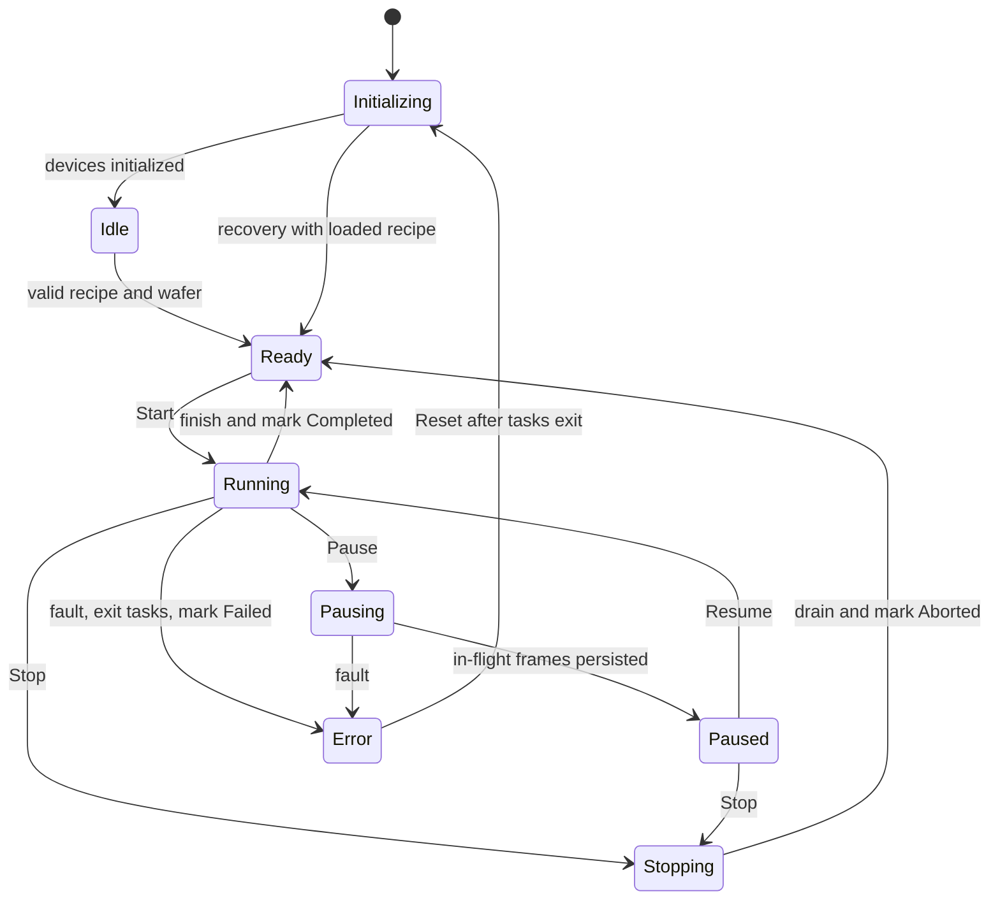

# Architecture and operational contracts

## Responsibility boundaries

Core owns immutable recipes, equipment states, run orchestration and interfaces. Infrastructure owns virtual devices, PGM decoding, pooled buffers, the native adapter and SQLite. Desktop and Runner reuse the same controller. The synthetic generator is a separate C++ executable; its manifest is consumed only by evaluation tools.

One stage moves and one camera captures in scan order. Frames can finish inspection out of order; results are keyed by RunId and die coordinates, so completion order does not affect the wafer map or traceability.

## Native ABI v1

The public header is `native/include/semiinspect.h`. It exports create/destroy, inspect, result-summary/defect accessors and result-release functions. Integers have explicit 32-bit widths, structures use default 8-byte packing, and calls use the Windows x64 C ABI. Managed declarations are generated by `LibraryImport`.

The caller pins the pooled grayscale buffer for the synchronous call. A worker's native context borrows this pointer and never retains it. The reference image is cloned during context creation. A context reuses internal `cv::Mat` storage, but no context is shared by concurrent workers. `SafeHandle` owns each engine and result allocation; exception-to-status conversion happens inside C++.

The frame's ownership moves from acquisition to the frame channel, worker, result channel and persistence writer. Persistence returns the buffer to the pool in a `finally` block. Engine disposal is serialized with calls. Native execution cannot be forcibly killed safely; cancellation stops further scheduling and waits for active calls.

## State transitions

Control commands are serialized. A duplicate Start and a recipe change during production are rejected. Pause stops new scheduling at a die boundary and drains the pipeline. Stop cancels cancelable simulated movement/capture, then drains acquired frames. Reset creates no continuation of the failed run; the following Start has a new RunId.

Invalid recipe is a rejected input, so it leaves the previous valid state intact. Operational faults raise an alarm immediately, cancel acquisition and enter Error after resource cleanup. The fault selector is applied before Start; clear it before Reset/restart.

## Persistence and timing

SQLite is protected by one semaphore, with WAL and `synchronous=NORMAL`. Result images are written before the result transaction. `(RunId,X,Y)` is unique. A result notification is emitted only after persistence succeeds. Run recipe snapshots are immutable JSON.

Capture-start timestamps use `Stopwatch` for duration and UTC for correlation. End-to-end latency includes acquisition, queueing, inspection, image writing and the first result commit. A second update persists that measured duration; this metadata update is excluded from the duration. Algorithm timing is measured inside C++. This distinction is recorded in benchmark reports.

Runs and state/alarm events are committed at run finalization. A process crash can leave a Running row and orphan image files; v1 does not include crash reconciliation or power-loss guarantees. On an actual unrecoverable storage failure, the UI reports Error even when updating the run row also fails.

## Synthetic inspection contract

512×512 8-bit frames contain an asymmetric marker, patterned inspection ROI and separate line-width ROI. Template matching estimates integer translation. The aligned reference difference is thresholded, closed morphologically and filtered by component area. Line width is averaged from interpolated half-intensity edge crossings across multiple rows.

The generator controls shift, brightness, noise, defect geometry and line width. Seeds partition development and independent evaluation. Only generic anomaly boxes are returned; particle/scratch/missing-pattern labels describe the generator's scenarios, not inferred physical defect classifications.
